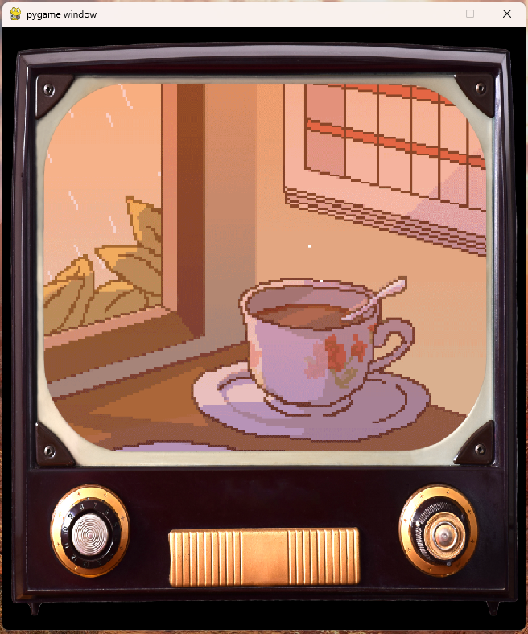

# pixel-art-display
Pixel art display em Python


<br>

# Instalação
```pip install -r requirements.txt```

# Execução
```python main.py imagem1.png imagem2.png imagem3.png```

## Imagem fullscreen
```python main.py imagem1.png imagem2.png imagem3.png --fullscreen```
